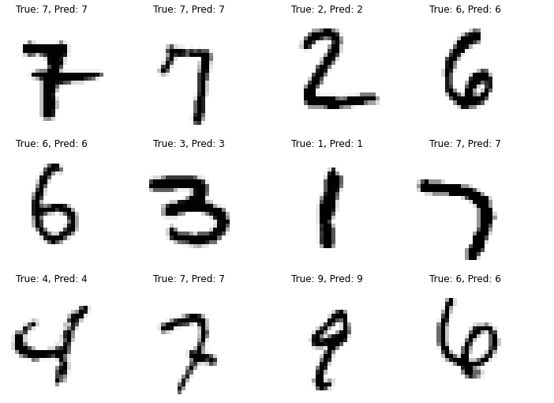
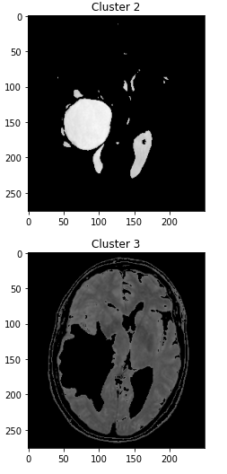
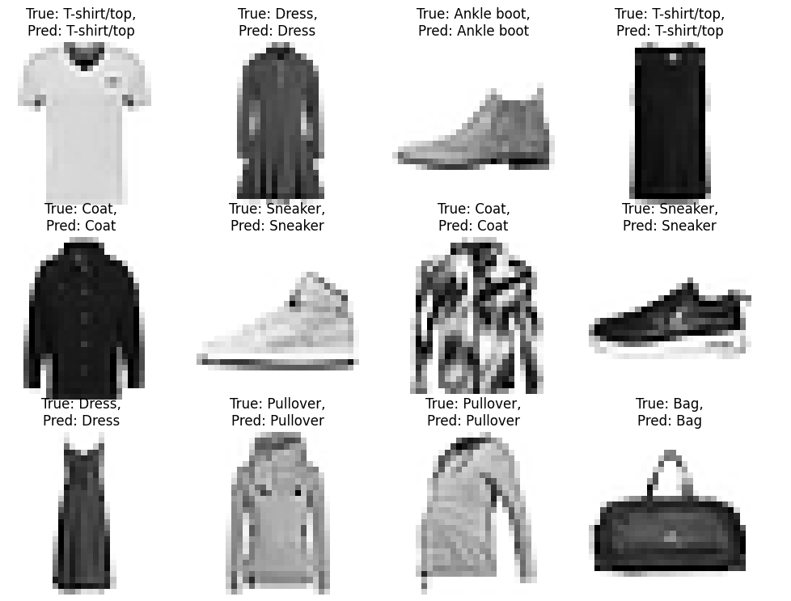
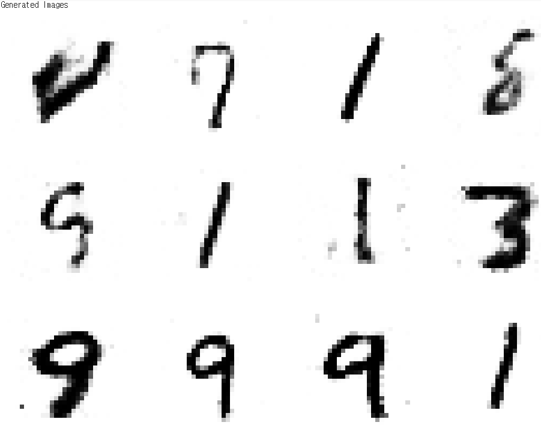

# AI-Study
AI 머신러닝 및 딥러닝 학습 자료입니다.
  
기초적인 Linear_Regression부터 딥러닝 심화학습(GAN, 강화학습)까지 업로드 하겠습니다.
    

Linear Regreeion을 이용한 당뇨병 예측
-------------
 
<figure class="half">
    
    
</figure>
    

KNN을 이용한 손글씨 인식 및 분류
-------------
 

    

k-means를 이용한 뇌 MRI Image Segmentation
-------------
 

    

CNN을 이용한 Fashion MNIST Image 분류
-------------
 

    

GAN을 이용한 MNIST 손글씨 Image 생성
-------------
 

    
  
