# AI-Study
AI 머신러닝 및 딥러닝 학습 자료 포트폴리오 입니다.
학습이 진행대는대로 순차적으로 업로드 하겠습니다.
  
- 기초 머신러닝
  - Linear Regression
  - K-NN
  - PCA
  - Support Vector Machine
  - K-Means
- 딥러닝
  - CNN
  - RNN
  - Generative Model
- 최적화 및 정규화
  - Transfer Learning
  - Data Augmentation
  

Linear Regression을 이용한 당뇨병 예측
-------------
 

  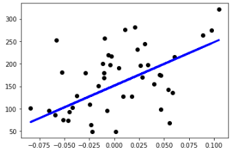
  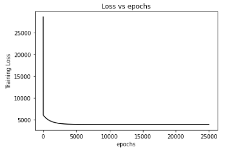

  

KNN을 이용한 손글씨 인식 with PCA
-------------
- Training Data : 50000  
- Test Data : 10000  
- K = 5
  

  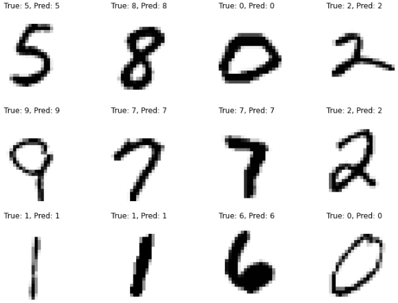　　　
  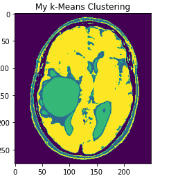

　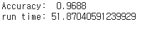　　　　　　
  

- KNN VS PCA 차원축소 
  - Run Time, Accuracy 차이 비교 -> 유의미한 결과 도출
   

K-Means를 이용한 뇌 MRI Image Segmentation
-------------
- K = 4 (Cluster 0-3)
  

  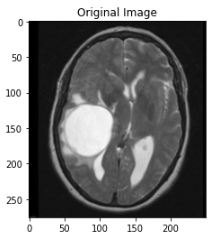
  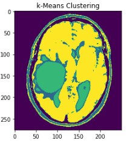

  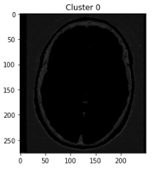
  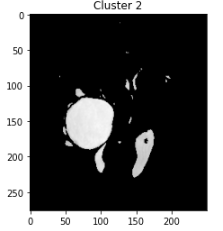

  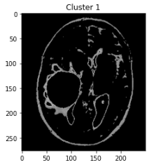
  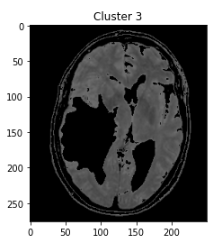

  

CNN Fashion MNIST Data Label Shuffle
-------------
- Training Data : 60000
- Test Data : 10000
   

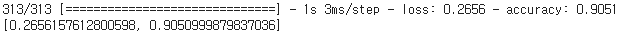

- 정상실행
- Accuracy : 90.51%
   

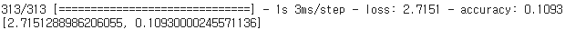

- Label Shuffle (무작위)
- Accuracy : 10.93%
   

- 결론 : Data를 잘못 설정해도 Loss는 조금씩 떨어지고 정확도는 조금씩 올라간다  
  - 만약 Loss 자체가 떨어지지 않는다면 Optimizer 문제 (Learning Rate)
   

CNN Transfer Learning(Fine-Tuning)
-------------

  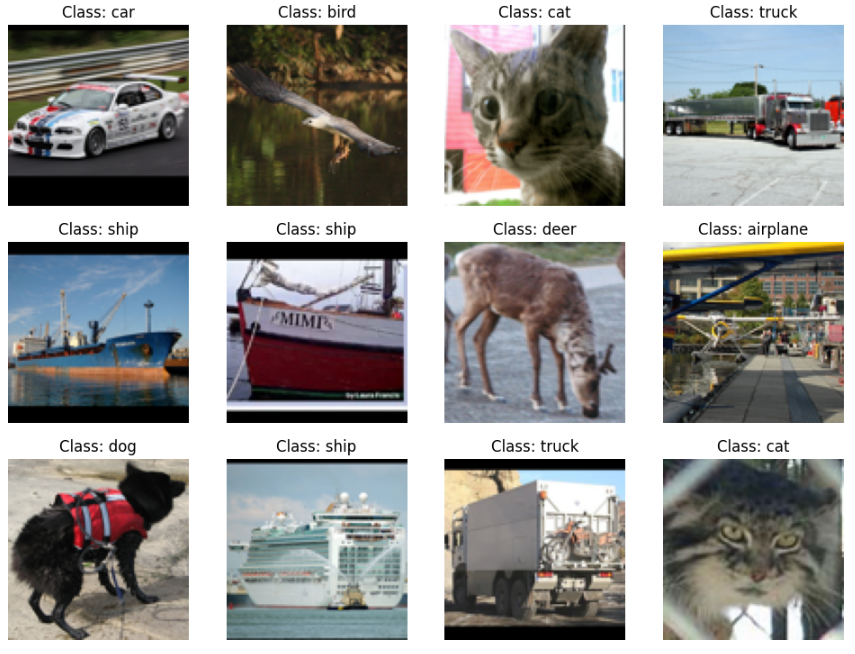
  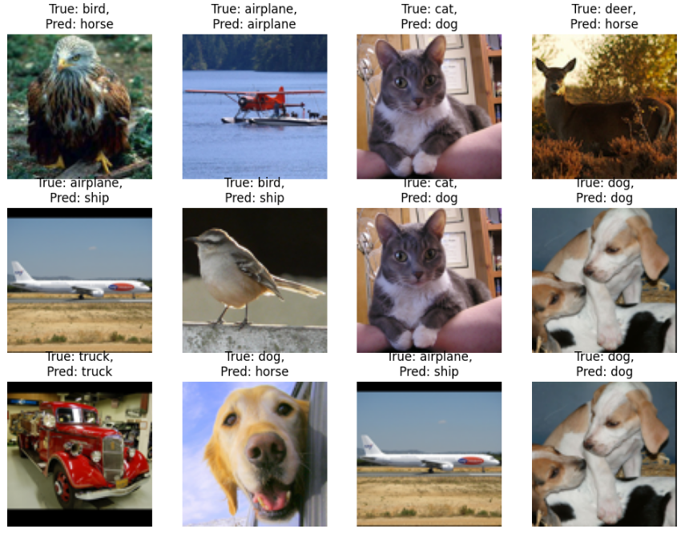
  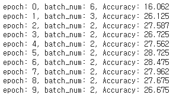

- 부족한 Data Training
  - Training Data : 5000 (Class당 500개 Data)
  - Test Data : 8000
  - Accuracy : 26.675%

  

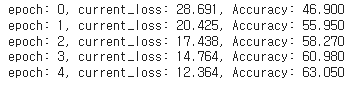

- 충분한 Data Training
  - Training Data : 50000
  - Test Data : 10000
  - Accuracy : 63.050%

  

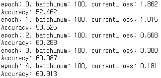

- Transer Learning
  - 마지막 8번 FC Layer 교체
  - Training Data : 5000
  - Test Data : 8000
  - Accuracy : 60.193%

 

- 결과 : 충분한 데이터 모델을 Pre-Training 시키고 다시 훈련 시 Accuracy 향상 -> 유의미한 결과 도출
  

GAN을 이용한 손글씨 Image 생성
-------------
- Training Data : 60000  
- Test Data : 10000
  

 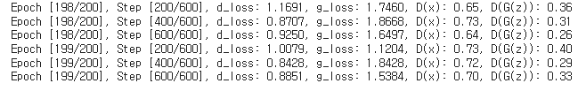
 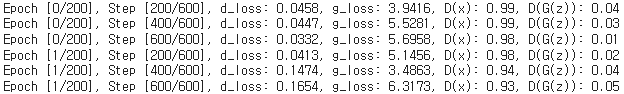
 
- D(g(z)) 변화 관찰
  - D(g(z) 수치가 향상될수록 good
    

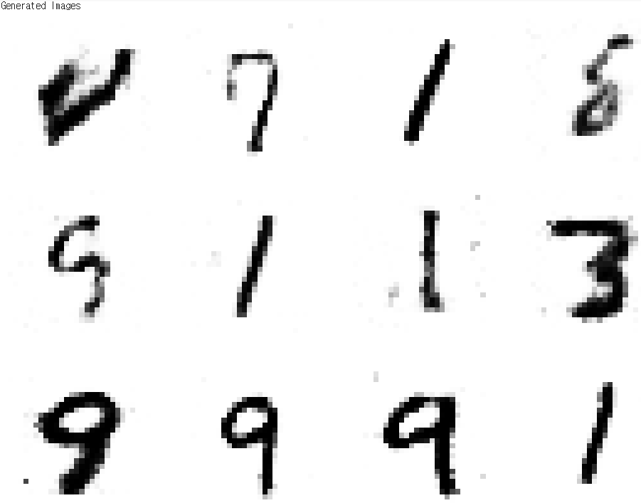

- Generator에 의해 생성된 손글씨 Image
  - 진짜 손글씨 이미지와 어느 정도 비슷한 가짜 이미지 생성 
   
