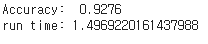

# AI-Study
AI 머신러닝 및 딥러닝 학습 자료입니다.
  
기초 머신러닝 Linear_Regression부터 딥러닝 심화학습(GAN, 강화학습)까지 업로드 하겠습니다.
    

Linear Regression을 이용한 당뇨병 예측
-------------
 

  
  

    

KNN을 이용한 손글씨 인식 with PCA
-------------
 

  
  

  
  

    

K-Means를 이용한 뇌 MRI Image Segmentation
-------------
 

  
  

  
  

  
  

    

GAN을 이용한 손글씨 Image 생성
-------------
 

    
  
