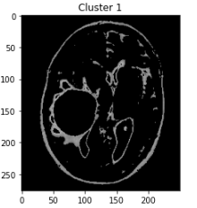

## Index

* Machine Learning
  * Linear Regression
  * KNN
  * PCA
  * Support Vector Machine
  * K-Means
* Deep Learning
  * CNN
  * RNN
  * Generative Model
  * Reinforcement Learning
* Optimization & Regularization
  * Labelling
  * Paramater
  * Activation Function
  * Data Augmentation
  * Transfer Learning

## Diabetes Prediction With Linear Regression

  
  

## MNIST Classification With KNN, PCA

* Train : 50,000 images
* Test : 10,000 images
* K = 5

  　　　
  

　　　　　　　　　
  

* KNN VS PCA 차원축소
  * Run Time, Accuracy 차이 비교 >> 유의미한 결과 도출

## Brain MRI Image Segmentation With K-Means

* K = 4 (Cluster 0-3)

  
  

  
  

  
  

## Fashion MNIST Classification With CNN & Data Label Random Shuffle

* Train : 60,000 images
* Test : 10,000 images

 

* 정상실행
  * Accuracy : 90.51%
* Label Shuffle (무작위)
  * Accuracy : 10.93%

 

* 결론 : Data를 잘못 설정해도 Loss는 조금씩 떨어지고 정확도는 조금씩 올라간다
  * 만약 Loss 자체가 떨어지지 않는다면 Optimizer 문제 (Learning Rate 체크)

## Transfer Learning With CNN (Fine-Tuning)

 

* 부족한 Data Training
  * Train : 5,000 images (Class당 500 images)
  * Test : 8,000 images
  * Accuracy : 26.675%

 

* 충분한 Data Training
  * Train : 50,000 images
  * Test : 10,000 images
  * Accuracy : 63.050%

 

* Transer Learning
  * 마지막 8번 FC Layer 교체
  * Train : 5,000 images
  * Test : 8,000 images
  * Accuracy : 60.193%

 

* 결과 : 충분한 데이터 모델을 Pre-Training 시키고 다시 훈련 시 Accuracy 향상 -> 유의미한 결과 도출

## MNIST Image Generation With GAN

* Train : 60,000 images
* Test : 10,000 images

 
 

* D(g(z)) 변화 관찰
  * D(g(z) 수치가 향상될수록 good

 

* Generator에 의해 생성된 손글씨 images
  * 진짜 손글씨 이미지와 어느 정도 비슷한 가짜 이미지 생성
